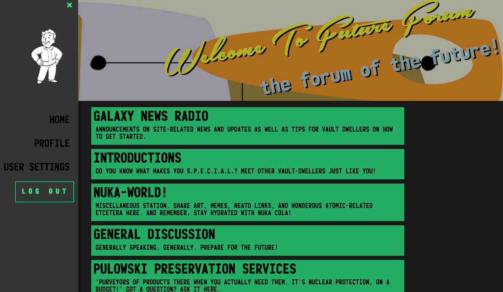

# Future Forum (the forum of the future)
 **_Are You Prepared For The Future?_**\
 Future Forum (v0.8) is a full stack application and community discussion board for all things Fallout. 
 Registration grants users a vault-dweller profile, with the ability to create discussions and comment on other user’s posts.

 >Future Forum was built in a 2 week sprint in early June 2018.\
 >as an ongoing side project, more features (and less bugs) will be added.

 ## Demo
deployed to heroku:\
https://futureforum.herokuapp.com/

 ## Screenshots

 ## Technologies used:
 
• [Express](https://github.com/expressjs/express) \
• [Node](https://github.com/nodejs/node) \
• [React](https://github.com/reactjs) \
• [Redux](https://github.com/reduxjs/react-redux) \
• [Redux-saga](https://github.com/redux-saga/redux-saga) \
• [PostgreSQL](https://www.postgresql.org/) \
• [Passport](http://www.passportjs.org/) \
• [React-Burger-Menu](https://github.com/negomi/react-burger-menu) \
• HTML/CSS

## Future Features TO DO LIST
[ ] ***Ability to edit user profile (reroute redux for user objects)*** \
[ ] Dynamic: mini profile, sidebar, and header navigation\
[ ] Routing to unique profile pages (from mini-profiles in threads)\
[ ] ***HTML-enabled/rich textbox for media posts and formatting ability***(new comment)\
[ ] (+ rich textbox for editing existing comments)\
[ ] Timestamps on posts + threads\
[ ] Chatbox\
[ ] Online users list\
[ ] + MORE\ 
